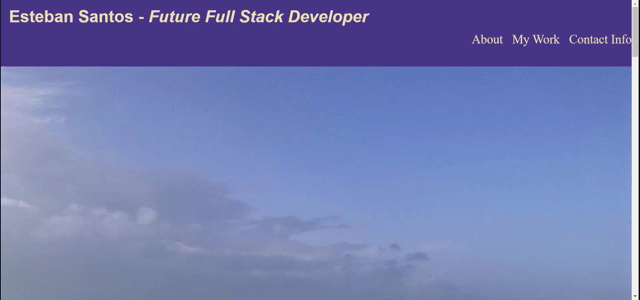

# myPortfolio
## Student of SMU Coding Bootcamp portfolio
Hello, this project contains the beginning of my portfolio. It exemplifies what I have learned so far in my SMU bootcamp class as of 5/09/2021. It is made up mostly of html and CSS code. This is my first step in embarking on my journey to achieve my goal of becoming a Full Stack Developer.

## Project development process

I began this project by creating a wireframe style mockup of what I wanted the web application to look like. I wrote in the initial paragraphs for the about me section and obtained some screenshot snips of what I was looking for each of my examples. The examples to use for my portfolio were the only ones that I had worked on before, so my 1st homework (refactor project) and several examples from the prework for the bootcamp.

When the mock-up was more of less completed, I started with the frame of the web app. I started coding with the HTML. I used ideas from previous activities of the week, namely the web store example. I set up each example as a box to be clicked by the user. This would take them to a link on a different tab to see an actual example of my work. I have left 2 placeholder boxes for future examples. 

This portfolio is just the starting point and I will continue to work and improve it to showcase what I have learned. 

**Link to portfolio:**
https://pricosaint.github.io/myPortfolio/

**The following .gif shows the functionality of the page**

